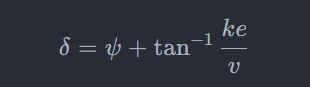
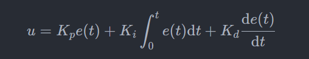

### 整体目标
给定地图与市区内的初始点和目的地，确定一条最短的路线，控制汽车的**油门**、**刹车**、**方向盘**，实现自动驾驶功能。

### 任务划分

* 给定百度地图中的数据，利用A\*搜索算法搭建一条最短的路径。
* 横向控制：利用Stanley控制器，对方向盘进行建模，根据路径，利用PD控制模拟汽车的循迹路线  

  <!-- ***Stanley控制器***： -->

  <!--  -->
* 纵向控制：利用PID控制器，对油门和刹车进行建模，利用PD控制模拟汽车的运行速度  

  <!-- ***PID控制器***： -->
  
  <!--  -->
* 得到仿真动画

### Bonus
* 进行十字路口、交通信号灯的建模
* 进行地面不平引起的坡度的建模
* to be continued……

### 参考资料

https://github.com/ahmedmoawad124/Self-Driving-Vehicle-Control
https://blog.csdn.net/zgpeace/article/details/121643308

#### 2024/03/01更新：利用图像处理技术，增加池化层处理地图数据，省去人工标注流程
#### 2024/03/12更新：利用贝塞尔插值平滑路径
